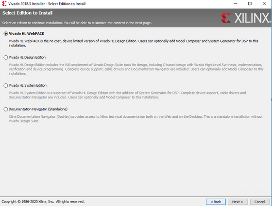
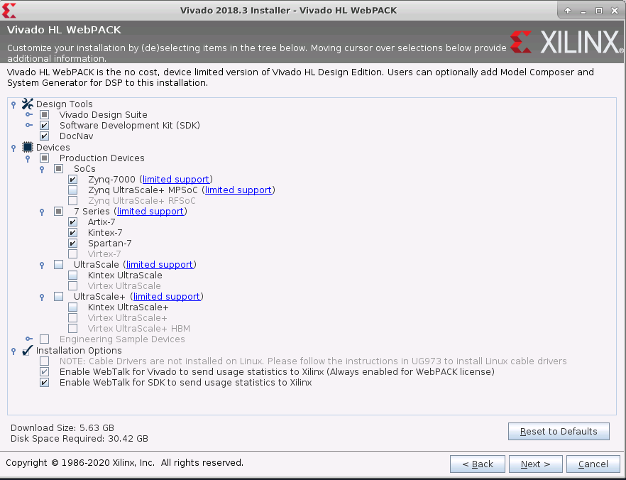
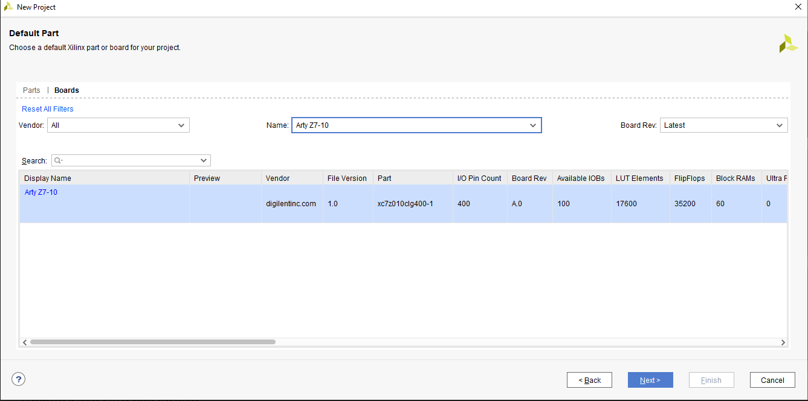
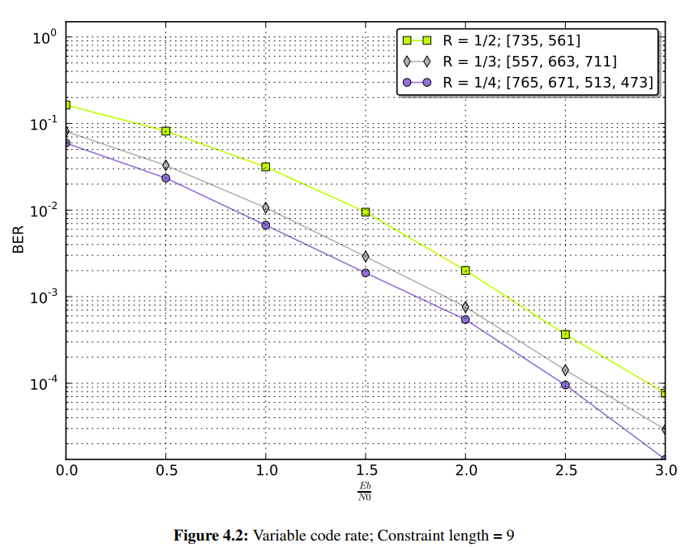
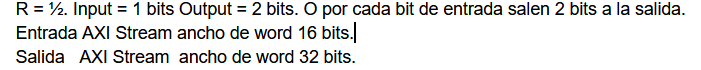

# PDS 2020:
Repositorio Materia PDS 2020. MESE UBA.

## Codigo de referencia:
* [Digital Design HQ](https://github.com/digital-design-hq/Digital-Resources). Aca tienen muchas referencia a código ya implementado yendo desde lo mas basico a lo mas avanzado.
* [EDA PLAYGROUND](https://www.edaplayground.com/playgrounds?searchString=&language=VHDL&simulator=&methodologies=&_libraries=on&_svx=on&_easierUVM=on&curated=true&_curated=on). Esta plataforma aparte de tener ejemplo de implementacion les va a permitir correr ejemplos. Ya que tienen disponibles distintos simuladores.
* [Doulos Referencia VHDL](https://www.doulos.com/knowhow/vhdl_designers_guide/#resources)
* [AXI STREAM TUTORIAL 1](http://fpgasite.blogspot.com/2017/07/xilinx-axi-stream-tutorial-part-1.html)
* [AXI STREAM TUTORIAL 2](http://www.googoolia.com/wp/2014/05/31/lesson-7-axi-stream-interface-in-detail-rtl-flow/)
* Otros sitios interesantes:
  *  [fpga4fun](https://www.fpga4fun.com/)
  *  [fpga4student](https://www.fpga4student.com/)
  *  [nandland](https://www.nandland.com/articles/fpga-101-fpgas-for-beginners.html)
  *  [surf vhdl](https://surf-vhdl.com/)

## Ejemplo de VHDL
[Link](./vhdl/):

Todos los ejemplos incluyen: Codigo RTL, testbench y script para cargar la simulación.

* **Clase 1**
  * Ejercicio Clase 1- 2 Proceso.[Link](./vhdl/ejercicio_clase_1_version_1) 
  * Ejercicio Clase 1- 1 Proceso. [Link](./vhdl/ejercicio_clase_1_version_2) 
  * Ejercicio Clase 1- Estructural. [Link](./vhdl/ejercicio_clase_1_version_3) 

* **Ejemplos complejidad simple**:
  * FFD con enable  [Link](./vhdl/test_ffd_vector)
  * Linea de retardo    [Link](./vhdl/test_ffd_vector_array)
  * Resize      [Link](./vhdl/test_resize)
  * Saturación  [Link](./vhdl/test_saturation)
  * Redondeo    [Link](./vhdl/test_round)
  * Shift   [Link](./vhdl/test_shift)
* **Ejemplos complejidad media:**
  * Multiplicador AXIS [Link](./vhdl/multiplicador_axis_fixed_point)
    * Entrada con Slave AXIS y salida Master AXIS. 
    * Lectura de datos del testbench desde un archivo.
    * Scripts de python para generar y analizar informacion.
  * Encoder Convolucional AXIS [Link](./vhdl/test_conv_encoder)
    * Entrada con Slave AXIS y salida Master AXIS. 
    * Entrada de 1 bit salida de 4 bits.
    * 2 bits de entrada para producir una salida valida de 4 bits.
    * Testbench que envia un contador de 0 a 15.
    * Script de Python utiliza scikit-dsp
  * Filtro Promediador AXIS [Link](./vhdl/test_promediador)
    * Entrada con Slave AXIS (8 bits) y salida AXIS.
    * Configuracion orden del promediador.
    * Excitación con respuesta impulsiva.
    * Truncamiento a la salida.


## Ejemplos de Python
[Link](./vhdl/python):
* **ventaneo_grafico.py**: Prueba el efecto del spreading con fun animation.
* **transformada_z_grafico.py**: Forma grafica de interpretar el efecto del diagrama de polos en Z en la respuesta de magnitud y de fase.
* **test_npy.py**: Prueba carga los archivos .npy que se obtienen con el pyfda.
* **generate_conv_data.py**: Archivo de utilidad para el Ejercicio 2 del TP1. Toma datos de 32 bits y los pasar por un encoder convolucional en python. Tener en mente que en su implementacion dependera el orden que tome si es LSB o MSB.
  * Instalar las dependedencia: [scikit-dsp-comm](https://scikit-dsp-comm.readthedocs.io/en/latest/readme.html)
* **Modulo de punto fijo:** [Link](./python/fxpoint)


## FAQ:

**Q:** Corriendo el ejemplo de python del codigo convolucional en python tengo el siguiente error:

```
File "/PDS/vhdl/test_conv_encoder/generate_result_vector.py", line 37, in <module>
    y = [np.packbits(item,bitorder = 'little')[0] for item in y]

  File "/PDS/vhdl/test_conv_encoder/generate_result_vector.py", line 37, in <listcomp>
    y = [np.packbits(item,bitorder = 'little')[0] for item in y]

TypeError: 'bitorder' is an invalid keyword argument for pack()
```

**A:** Aca lo masw seguro es actualizar el numpy, ya que la funcion np.pack no tuvo el parametros bitorder hasta despues la version 1.15.[Link](https://docs.scipy.org/doc/numpy-1.15.0/reference/generated/numpy.packbits.html).

Esto aplicaria tanto para:
  * Script de prueba para el ejercicio 2.[Link](./vhdl/python/../../python/generate_conv_data.py) 
  * Script para chequear con el encoder convolucional reducido:[Link](./vhdl/test_conv_encoder/generate_result_vector.py)


**Q:**¿quisiera pedirte si tendrias algun ejemplo de código de PISO?.

**A:** Aca tienen un ejemplo interesante: [Link](https://surf-vhdl.com/how-to-implement-a-parallel-to-serial-converter/).
Tambien coloo en el repo un ejemplo de PISO: [Link](./vhdl/test_piso/../teset_piso/piso.vhd)


**Q:** Alguien sabe que opcion debemos marcar en la siguiente imagen durante la instalacion de Vivado?

**A:** Aca lo que hay que tildar es la opción Vivado HL Webpack. Cuando se seleccionan los dispositivos no utilizar los que indican MPSOC y UltraScale, es para las FPGAs mas avanzadas de Xilinx, las cuales por lo general necesitan licencia y nos va a descargar mucho mas contenido.



## Dispositivos a instalar:




**Q**: En cuanto al QuestaSim tenes idea si se puede trabajar en Linux?

**A**: Aca lo recomendable es utilizar el simulador del Vivado que ya viene embebido o GHDL, por la simplicidad recomendamos usar el que viene con Vivado. Por lo que tengo entendi Questa tiene soporte para Red Hat.

**Q**: Vivado Boards para el 2018.3 ?

**A**: Para poder trabajar las placas de Digilent estos tienen un repositorio en el cual tienen los archivos  que tienen los constraint de pines de los dispositivos. Estos sirve para generar los binarios.  De no tenerlos hay que entrar al esquematico y hacerlo pin por pin.

[Repositorio Digilent](https://github.com/Digilent/vivado-boards)

[Instrucciones de instalacion](https://reference.digilentinc.com/vivado/installing-vivado/start#installing_digilent_board_files)

#### Cuando  generan un projecto lo filtran asi:


**Q**: En el ejercicio 1 del TP1?:
1. ¿ Como no nombra el clk, debería ser combinacional? o podría ser secuencial también?
2. ¿Debería haber carry por si hay overflow (ya que todo es de 16bits)? 

1-Para la primera pregunta esta bloque seria solo combinacional con lo cual pueden resolverlo con un process combinacional o tambien utilizando sentencias concurrentas. Queda a criterio de ustedes.

2-La idea del ejercicio cuando hagas la suma en el simulador veas el efecto del overflow, por ejemplo si en elñ testbench excitan con 2 señales que tengan el maximo valor de 16 bits. Por el momento es solo repaso y ver la sintaxis por lo tanto no es fundamental el overflow pero el detalle de la pregunta es fundamental para los ejercicios que vendran despues.

**Q:** Durante la simulacion se observan glitches?

Estos se dan cuando tenemos circuitos combinacionales, a pesar de la simulación ser ideal se observan estos glitches. Estos se deben porque el simulador tiene instancias concurrentes que simulan con orden aleatoria, observar que se esta simulando HW con SW.

En una simulación Post Place and Route este efecto se vería agrandado por las diferencias de tiempos entre los distintos componentes de la FPGA. Si le hacen zoom en el simulador a este efecto va a observa que su delta t es igual a 0.


**Q:** Ubicacion ejemplo AXIS?:

**A:** Pueden encontrar un ejemplo de implementación con aritmetica de punto fijo y lectura/escritura de archivos en : [Link](./vhdl/multiplicador_axis_fixed_point/)


 **Q:** Alguien sabe que biblioteca provee zplane()
 
 **A:** Este se encuentra como una función en los notebook que vimos clase a clase.
 Por las dudas la vuelvo a colocar:


```python
#Declaracion de importaciones y de la funcion para dibujar el zplane
import numpy as np
import matplotlib.pyplot as plt
from  matplotlib import patches
from matplotlib.figure import Figure
from matplotlib import rcParams

#No tenemos zplane declara da con lo cual directamnete ubicamos esta implementacion en stackoverflow.
def zplane(b,a,filename=None):
    """Plot the complex z-plane given a transfer function.
    """

    # get a figure/plot
    ax = plt.subplot(111)

    # create the unit circle
    uc = patches.Circle((0,0), radius=1, fill=False,
                        color='black', ls='dashed')
    ax.add_patch(uc)

    # The coefficients are less than 1, normalize the coeficients
    if np.max(b) > 1:
        kn = np.max(b)
        b = b/float(kn)
    else:
        kn = 1

    if np.max(a) > 1:
        kd = np.max(a)
        a = a/float(kd)
    else:
        kd = 1
        
    # Get the poles and zeros
    p = np.roots(a)
    z = np.roots(b)
    k = kn/float(kd)
    
    # Plot the zeros and set marker properties    
    t1 = plt.plot(z.real, z.imag, 'go', ms=10)
    plt.setp( t1, markersize=10.0, markeredgewidth=1.0,
              markeredgecolor='k', markerfacecolor='g')

    # Plot the poles and set marker properties
    t2 = plt.plot(p.real, p.imag, 'rx', ms=10)
    plt.setp( t2, markersize=12.0, markeredgewidth=3.0,
              markeredgecolor='r', markerfacecolor='r')

    ax.spines['left'].set_position('center')
    ax.spines['bottom'].set_position('center')
    ax.spines['right'].set_visible(False)
    ax.spines['top'].set_visible(False)

    # set the ticks
    r = 1.5; plt.axis('scaled'); plt.axis([-r, r, -r, r])
    ticks = [-1, -.5, .5, 1]; plt.xticks(ticks); plt.yticks(ticks)

    if filename is None:
        plt.show()
    else:
        plt.savefig(filename)
    

    return z, p, k
```


### TP1 Ejercicio 2:
**Q:** Que significa R=1/2?

**A:**: Significa que por cada bit de entrada tenes dos de salida
Los codigos convolucionales se expresan asi, por ejemplo si queres mejor redundancia se especifica tal vez un 1/3 que agrega un bit mas.
Por ahi en Internet esta la comparacion de la ganancia de los códigos dependiendo distintas configuraciones. Pero todos los encoder siguen la misma arquitectura.

**A continuacion colocamos una comparacion entre distintos codigos: solo donde se cambia el R**


Los codigo con un R menos o sea 1/3 o 1/4, tienen al mismo EB/NO menor Bit error rate, lo que quiere decir que transmiten mejor la informacion. (El costo de hacer esto es el Ancho de Banda).

**Q:** Estoy viendo que si desplazo los bits en el registro con una determinada frecuencia de reloj, la salida en realidad tiene el doble de esa frecuencia.

**A:** Lo del doble de la frecuencia depende como saques los datos. Si los sacas en serie o sea por cada ciclo de reloj sacas un bit entonces si tenes que ir al doble de frecuencia. 
En cambio si trabajas en paralelo eso quiere decir que por cada ciclo de reloj sacas 2 bits. Conservas la misma frecuencia de entrada. (La tasa de informacion es la misma)

El ejercicio pide aumentar el ancho de la palabra para no lidiar con la problema del cambio de dominio de reloj.




