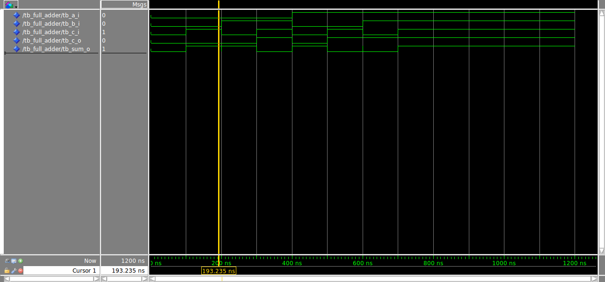

# PDS 2020:
Repositorio Materia PDS 2020. MESE UBA.

- [PDS 2020:](#pds-2020)
  - [Links de la materia](#links-de-la-materia)
  - [Codigo de referencia](#codigo-de-referencia)
  - [Ejemplo de VHDL](#ejemplo-de-vhdl)
  - [Ejemplos de Python](#ejemplos-de-python)
  - [FAQ:](#faq)
    - [VHDL](#vhdl)
    - [Vivado y Questasim](#vivado-y-questasim)
    - [TP 1 Ejercicio 1](#tp-1-ejercicio-1)
    - [TP1 Ejercicio 2](#tp1-ejercicio-2)
    - [TP1 Ejercicio 3](#tp1-ejercicio-3)

## Links de la materia

[LINK DISCORD](https://discord.gg/KnSgbS)
[LINK DRIVE](https://drive.google.com/drive/folders/1vd8Y5M5hvQPr2y9doFDwbJeGxxkJ7aZb?usp=sharing)

## Codigo de referencia
* [Digital Design HQ](https://github.com/digital-design-hq/Digital-Resources). Aca tienen muchas referencia a código ya implementado yendo desde lo mas basico a lo mas avanzado.
* [EDA PLAYGROUND](https://www.edaplayground.com/playgrounds?searchString=&language=VHDL&simulator=&methodologies=&_libraries=on&_svx=on&_easierUVM=on&curated=true&_curated=on). Esta plataforma aparte de tener ejemplo de implementacion les va a permitir correr ejemplos. Ya que tienen disponibles distintos simuladores.
* [Doulos Referencia VHDL](https://www.doulos.com/knowhow/vhdl_designers_guide/#resources)
* [AXI STREAM TUTORIAL 1](http://fpgasite.blogspot.com/2017/07/xilinx-axi-stream-tutorial-part-1.html)
* [AXI STREAM TUTORIAL 2](http://www.googoolia.com/wp/2014/05/31/lesson-7-axi-stream-interface-in-detail-rtl-flow/)
* Otros sitios interesantes:
  *  [fpga4fun](https://www.fpga4fun.com/)
  *  [fpga4student](https://www.fpga4student.com/)
  *  [nandland](https://www.nandland.com/articles/fpga-101-fpgas-for-beginners.html)
  *  [surf vhdl](https://surf-vhdl.com/)
  *  [vhdl guide](https://vhdlguide.readthedocs.io/)

## Ejemplo de VHDL
[Link](./vhdl/):

Todos los ejemplos incluyen: Codigo RTL, testbench y script para cargar la simulación.

* **Clase 1**
  * Ejercicio Clase 1- 2 Proceso.   [Link](./vhdl/ejercicio_clase_1_version_1) 
  * Ejercicio Clase 1- 1 Proceso.   [Link](./vhdl/ejercicio_clase_1_version_2) 
  * Ejercicio Clase 1- Estructural. [Link](./vhdl/ejercicio_clase_1_version_3) 

* **Ejemplos complejidad simple**:
  * FFD con enable      [Link](./vhdl/test_ffd_vector)
  * Linea de retardo    [Link](./vhdl/test_ffd_vector_array)
  * Resize              [Link](./vhdl/test_resize)
  * Saturación          [Link](./vhdl/test_saturation)
  * Redondeo            [Link](./vhdl/test_round)
  * Shift               [Link](./vhdl/test_shift)
* **Ejemplos complejidad media:**
  * Multiplicador AXIS [Link](./vhdl/multiplicador_axis_fixed_point)
    * Entrada con Slave AXIS y salida Master AXIS. 
    * Lectura de datos del testbench desde un archivo.
    * Scripts de python para generar y analizar informacion.
  * Encoder Convolucional AXIS [Link](./vhdl/test_conv_encoder)
    * Entrada con Slave AXIS y salida Master AXIS. 
    * Entrada de 1 bit salida de 4 bits.
    * 2 bits de entrada para producir una salida valida de 4 bits.
    * Testbench que envia un contador de 0 a 15.
    * Script de Python utiliza scikit-dsp
  * Filtro Promediador AXIS [Link](./vhdl/test_promediador)
    * Entrada con Slave AXIS (8 bits) y salida AXIS.
    * Configuracion orden del promediador.
    * Excitación con respuesta impulsiva.
    * Truncamiento a la salida.
  * Filtro Promediador Alumnos [Link](./vhdl/test_promediador_alumnos/)
    * Idem que el promediador, es el que estamos resolviendo en clases.

## Ejemplos de Python
[Link](./vhdl/python):
* **ventaneo_grafico.py**: Prueba el efecto del spreading con fun animation.
* **transformada_z_grafico.py**: Forma grafica de interpretar el efecto del diagrama de polos en Z en la respuesta de magnitud y de fase.
* **test_npy.py**: Prueba carga los archivos .npy que se obtienen con el pyfda.
* **generate_conv_data.py**: Archivo de utilidad para el Ejercicio 2 del TP1. Toma datos de 32 bits y los pasar por un encoder convolucional en python. Tener en mente que en su implementacion dependera el orden que tome si es LSB o MSB.
  * Instalar las dependedencia: [scikit-dsp-comm](https://scikit-dsp-comm.readthedocs.io/en/latest/readme.html)
* **Modulo de punto fijo:** [Link](./python/fxpoint)


## FAQ:

### VHDL
**Q:** Templates para FSM:
Pueden observar el siguiente LINK: [Link](https://vhdlguide.readthedocs.io/en/latest/vhdl/fsm.html)

Recomiendo los siguiente esquemas con respecto a los templates de FSM, ya que le va agregando features.:

**Moore**
```vhdl
-- moore_regular_template.vhd

library ieee; 
use ieee.std_logic_1164.all;
use ieee.numeric_std.all;

entity moore_regular_template is 
generic (
    param1 : std_logic_vector(...) := <value>;
    param2 : unsigned(...) := <value>
    );
port (
    clk, reset : in std_logic;
    input1, input2, ... : in std_logic_vector(...);
    output1, output2, ... : out signed(...)
);
end entity; 

architecture arch of moore_regular_template is 
    type stateType is (s0, s1, s2, s3, ...);
    signal state_reg, state_next : stateType; 
begin 
    -- state register : state_reg
    -- This process contains sequential part and all the D-FF are 
    -- included in this process. Hence, only 'clk' and 'reset' are 
    -- required for this process. 
    process(clk, reset)
    begin
        if reset = '1' then
            state_reg <= s1;
        elsif (clk) then
            state_reg <= state_next;
        end if;
    end process; 
    
    -- next state logic : state_next
    -- This is combinational of the sequential design, 
    -- which contains the logic for next-state
    -- include all signals and input in sensitive-list except state_next
    process(input1, input2, state_reg) 
    begin 
        state_next <= state_reg; -- default state_next
        case state_reg is
            when s0 =>
                if <condition> then -- if (input1 = '01') then
                    state_next <= s1; 
                elsif <condition> then  -- add all the required conditionstions
                    state_next <= ...; 
                else -- remain in current state
                    state_next <= s0; 
                end if;
            when s1 => 
                if <condition> then -- if (input1 = '10') then
                    state_next <= s2; 
                elsif <condition> then  -- add all the required conditionstions
                    state_next <= ...; 
                else -- remain in current state
                    state_next <= s1; 
                end if;
            when s2 =>
                ...
        end case;
    end process; 
        
    -- combination output logic
    -- This part contains the output of the design
    -- no if-else statement is used in this part
    -- include all signals and input in sensitive-list except state_next
    process(input1, input2, ..., state_reg) 
    begin
        -- default outputs
        output1 <= <value>;
        output2 <= <value>;
        ...
        case state_reg is 
            when s0 =>
                output1 <= <value>;
                output2 <= <value>;
                ...
            when s1 =>
                output1 <= <value>;
                output2 <= <value>;
                ...
            when s2 =>
                ...
        end case; 
    end process; 
        
    -- optional D-FF to remove glitches
    process(clk, reset)
    begin 
        if reset = '1' then 
            new_output1 <= ... ;
            new_output2 <= ... ;
        elsif rising_edge(clk) then
            new_output1 <= output1; 
            new_output2 <= output2; 
        end if;
    end process; 
end architecture;   
```

**Mealy**

```vhdl
-- mealy_regular_template.vhd

library ieee; 
use ieee.std_logic_1164.all;
use ieee.numeric_std.all;

entity mealy_regular_template is 
generic (
    param1 : std_logic_vector(...) := <value>;
    param2 : unsigned(...) := <value>
    );
port (
    clk, reset : in std_logic;
    input1, input2, ... : in std_logic_vector(...);
    output1, output2, ... : out signed(...)
);
end entity; 

architecture arch of mealy_regular_template is 
    type stateType is (s0, s1, s2, s3, ...);
    signal state_reg, state_next : stateType; 
begin 
    -- state register : state_reg
    -- This process contains sequential part and all the D-FF are 
    -- included in this process. Hence, only 'clk' and 'reset' are 
    -- required for this process. 
    process(clk, reset)
    begin
        if reset = '1' then
            state_reg <= s1;
        elsif (clk) then
            state_reg <= state_next;
        end if;
    end process; 
    
    -- next state logic and outputs
    -- This is combinational of the sequential design, 
    -- which contains the logic for next-state and outputs
    -- include all signals and input in sensitive-list except state_next
    process(input1, input2, ..., state_reg) 
    begin 
        state_next <= state_reg; -- default state_next
        -- default outputs
        output1 <= <value>;
        output2 <= <value>;
        ...
        case state_reg is
            when s0 =>
                if <condition> then -- if (input1 = '01') then
                    output1 <= <value>;
                    output2 <= <value>;
                    ...
                    state_next <= s1; 
                elsif <condition> then  -- add all the required conditionstions
                    output1 <= <value>;
                    output2 <= <value>;
                    ...
                    state_next <= ...; 
                else -- remain in current state
                    output1 <= <value>;
                    output2 <= <value>;
                    ...
                    state_next <= s0; 
                end if;
            when s1 =>
                ...
        end case;
    end process;  
        
    -- optional D-FF to remove glitches
    process(clk, reset)
    begin 
        if reset = '1' then 
            new_output1 <= ... ;
            new_output2 <= ... ;
        elsif rising_edge(clk) then
            new_output1 <= output1; 
            new_output2 <= output2; 
        end if;
    end process; 
end architecture;
```

**Q:** A que nos referimos con señales activo bajo y activo alto:?

**A:** Por ejemplo cuando decimos reset activo bajo:

* Activo bajo, significa que cuando el reset es ='0' se hace el reset.
* Activo alto, significa que cuando el reset es  ='1' se hace el reset.

En los procesos sincronicos el reset se aplica las siguientes lineas:


Esto tambien puede aplicarse para señales de enable, o de chip select CS.

**Q:** Ubicacion ejemplo AXIS?:

**A:** Pueden encontrar un ejemplo de implementación con aritmetica de punto fijo y lectura/escritura de archivos en : [Link](./vhdl/multiplicador_axis_fixed_point/)


 **Q:** Alguien sabe que biblioteca provee zplane()
 
 **A:** Este se encuentra como una función en los notebook que vimos clase a clase.
 Por las dudas la vuelvo a colocar:


```python
#Declaracion de importaciones y de la funcion para dibujar el zplane
import numpy as np
import matplotlib.pyplot as plt
from  matplotlib import patches
from matplotlib.figure import Figure
from matplotlib import rcParams

#No tenemos zplane declara da con lo cual directamnete ubicamos esta implementacion en stackoverflow.
def zplane(b,a,filename=None):
    """Plot the complex z-plane given a transfer function.
    """

    # get a figure/plot
    ax = plt.subplot(111)

    # create the unit circle
    uc = patches.Circle((0,0), radius=1, fill=False,
                        color='black', ls='dashed')
    ax.add_patch(uc)

    # The coefficients are less than 1, normalize the coeficients
    if np.max(b) > 1:
        kn = np.max(b)
        b = b/float(kn)
    else:
        kn = 1

    if np.max(a) > 1:
        kd = np.max(a)
        a = a/float(kd)
    else:
        kd = 1
        
    # Get the poles and zeros
    p = np.roots(a)
    z = np.roots(b)
    k = kn/float(kd)
    
    # Plot the zeros and set marker properties    
    t1 = plt.plot(z.real, z.imag, 'go', ms=10)
    plt.setp( t1, markersize=10.0, markeredgewidth=1.0,
              markeredgecolor='k', markerfacecolor='g')

    # Plot the poles and set marker properties
    t2 = plt.plot(p.real, p.imag, 'rx', ms=10)
    plt.setp( t2, markersize=12.0, markeredgewidth=3.0,
              markeredgecolor='r', markerfacecolor='r')

    ax.spines['left'].set_position('center')
    ax.spines['bottom'].set_position('center')
    ax.spines['right'].set_visible(False)
    ax.spines['top'].set_visible(False)

    # set the ticks
    r = 1.5; plt.axis('scaled'); plt.axis([-r, r, -r, r])
    ticks = [-1, -.5, .5, 1]; plt.xticks(ticks); plt.yticks(ticks)

    if filename is None:
        plt.show()
    else:
        plt.savefig(filename)
    

    return z, p, k
```
**Q:** Problemas Matplotlib y PYFDA
**A:** Hemos encontrado que el modulo maplotlib tenia un incoveniente con el pyfda. En las ultimas versiones anaconda teniamos la version 3.3.0. 
Lo que vimos que haciendo un downgrade a la version 3.0.3 se soluciona este problema.

De lo contrario no arranca nunca el pyfda.
En un entorno hacen lo siguiente:
```
conda install matplotlib=3.0.3
```

**Q:** Señales de salida con valor desconocido (Esto es unknown en el questa aparecen de color rojo).


**A:** En cualquier módulo que quiera realizarse, todas las salidas deben asignarse durante la etapa de reset. Eas una buena practica de diseño mas teniendo en cuenta que adelante pueden haber modulos que actuen o hagan acciones teniendo en cuenta estas señales.

Para este caso podriamos hacer:

```vhdl 
    if(a_reset_ni = '0')
        m_axis_tvalid_o <= '0';
        m_axis_tdata_o  <= '0';
        s_axis_tready_o <= '0';
    elsif (rising_edge(clk_i))
        etc
        etc
        etc
```


**Q**: El vivado me tira el siguiente error:
 ```
"ERROR: [VRFC 10-664] expression has 34 elements ; expected 32 [/MSE/PDS/tp1/punto2/test/conv_encoder_rtl.vhd:132]
 ```

**A**: Esto surgio de modificar el ejemplo del encoder convolucional mas simple que mande como codigo de referencia. [Link](./vhdl/test_conv_encoder/)

El codigo que tira el error en especial es el siguiente:
```vhdl
 v.m_axis_tdata := regs.m_axis_tdata(31 downto 0) & temp_result
```

VHDL es muy estricto con los anchos de la palabras, y nunca toma desiciones para achicar o agregar un word.
El comando ´&´ es una concatenación de arrays-
Entonces si tu resultado es de 32 bits tenes que concatenar uno de 30 bits con otros de 2 bits. (Fijate que temp result tiene un ancho de 2 bits)
En el caso del error estan conctenando un array de 32 bits con otro de 2. Lo cual da 34 bits pero el tamaño donde vamos a depositar el resultado es de 32 bits.

Mas sobre el comando : **&** [Link](https://www.csee.umbc.edu/portal/help/VHDL/operator.html)


### Vivado y Questasim

**Q:** Donde estan los templates del vivado?:

**A:** Abriendo directamente el Vivado tienen ahi, en ---> Tools --> Lenguage Templates. Los templates que nos da Xilinx.

Van desde como hacer bloque basicos como sumadores o shift register hasta como instanciar un bloque DSP48 entre otras cosas.


**Por ejemplo podemos ver como instanciar una FIFO AXI STREAM**


**Q:** Cuando corro los ejemplos en VHDL en el Vivado no los puedo simular.

**A:** Por defecto cuando cargamos un archivo de VHDL en el Vivado, los hace con VHDL 2002.
Como los codigos de ejemplo estan escritos con VHDL 2008 pueden haber sintaxis que el Vivado no interpreta:
Por ejemplo: el **process(all)**.

Yendo archivo por archivo del projecto tienen que cambiar el propertie type de VHDL a VHDL 2009.


Tambien si generan el projecto con tcl, cambian el propertie directamente usando la consola o en la creacion del projecto:

```tcl
set_property file_type {VHDL 2008} [get_files  "conv_encoder_2p_rtl.vhd"]
set_property file_type {VHDL 2008} [get_files  "conv_encoder_2p_rtl_tb.vhd"]
```

**Q:**¿quisiera pedirte si tendrias algun ejemplo de código de PISO?.

**A:** Aca tienen un ejemplo interesante: [Link](https://surf-vhdl.com/how-to-implement-a-parallel-to-serial-converter/).
Tambien coloo en el repo un ejemplo de PISO: [Link](./vhdl/test_piso/../teset_piso/piso.vhd)


**Q:** Alguien sabe que opcion debemos marcar en la siguiente imagen durante la instalacion de Vivado?

**A:** Aca lo que hay que tildar es la opción Vivado HL Webpack. Cuando se seleccionan los dispositivos no utilizar los que indican MPSOC y UltraScale, es para las FPGAs mas avanzadas de Xilinx, las cuales por lo general necesitan licencia y nos va a descargar mucho mas contenido.


**Dispositivos a instalar:**


**Q**: En cuanto al QuestaSim tenes idea si se puede trabajar en Linux?

**A**: Aca lo recomendable es utilizar el simulador del Vivado que ya viene embebido o GHDL, por la simplicidad recomendamos usar el que viene con Vivado. Por lo que tengo entendi Questa tiene soporte para Red Hat.

**Q**: Vivado Boards para el 2018.3 ?

**A**: Para poder trabajar las placas de Digilent estos tienen un repositorio en el cual tienen los archivos  que tienen los constraint de pines de los dispositivos. Estos sirve para generar los binarios.  De no tenerlos hay que entrar al esquematico y hacerlo pin por pin.

[Repositorio Digilent](https://github.com/Digilent/vivado-boards)

[Instrucciones de instalacion](https://reference.digilentinc.com/vivado/installing-vivado/start#installing_digilent_board_files)

**Cuando  generan un projecto lo filtran asi:**


### TP 1 Ejercicio 1

**Q**: En el ejercicio 1 del TP1?:
1. ¿ Como no nombra el clk, debería ser combinacional? o podría ser secuencial también?
2. ¿Debería haber carry por si hay overflow (ya que todo es de 16bits)? 

1-Para la primera pregunta esta bloque seria solo combinacional con lo cual pueden resolverlo con un process combinacional o tambien utilizando sentencias concurrentas. Queda a criterio de ustedes.

2-La idea del ejercicio cuando hagas la suma en el simulador veas el efecto del overflow, por ejemplo si en elñ testbench excitan con 2 señales que tengan el maximo valor de 16 bits. Por el momento es solo repaso y ver la sintaxis por lo tanto no es fundamental el overflow pero el detalle de la pregunta es fundamental para los ejercicios que vendran despues.

**Q:** Durante la simulacion se observan glitches?

Estos se dan cuando tenemos circuitos combinacionales, a pesar de la simulación ser ideal se observan estos glitches. Estos se deben porque el simulador tiene instancias concurrentes que simulan con orden aleatoria, observar que se esta simulando HW con SW.

En una simulación Post Place and Route este efecto se vería agrandado por las diferencias de tiempos entre los distintos componentes de la FPGA. Si le hacen zoom en el simulador a este efecto va a observa que su delta t es igual a 0.




**Q**: Si no entendí mal dijiste que la suma de las señales no podía ser directamente, que tenia que hacerse previo conversión a unsigned, ¿es correcto?

**A**: Si tal cual es asi, es siempre conveniente hacer la suma con unsigned que esta definida. Estamos usando lo que se recomienda actualmente que es la libreria **numeric_std**. (tiene definida las operacion para los tipos signed,unsigned e integer)
Antes estaban las libreria de synopsis **ieee.std_logic_arith, ieee.std_logic_unsigned/signed** 
Estas tienen definidad las operacion para std_logic, std_logic_vector e integer.

**Utilizar siempre numeric_std y usar el siguiente grafico:**


**Q**: Como hacer las and y las or a los vectores.

**A**: Estas se pueden a


### TP1 Ejercicio 2

**Q:** Que significa R=1/2?

**A:**: Significa que por cada bit de entrada tenes dos de salida
Los codigos convolucionales se expresan asi, por ejemplo si queres mejor redundancia se especifica tal vez un 1/3 que agrega un bit mas.
Por ahi en Internet esta la comparacion de la ganancia de los códigos dependiendo distintas configuraciones. Pero todos los encoder siguen la misma arquitectura.

**A continuacion colocamos una comparacion entre distintos codigos: solo donde se cambia el R**


Los codigo con un R menos o sea 1/3 o 1/4, tienen al mismo EB/NO menor Bit error rate, lo que quiere decir que transmiten mejor la informacion. (El costo de hacer esto es el Ancho de Banda).

**Q:** Estoy viendo que si desplazo los bits en el registro con una determinada frecuencia de reloj, la salida en realidad tiene el doble de esa frecuencia.

**A:** Lo del doble de la frecuencia depende como saques los datos. Si los sacas en serie o sea por cada ciclo de reloj sacas un bit entonces si tenes que ir al doble de frecuencia. 
En cambio si trabajas en paralelo eso quiere decir que por cada ciclo de reloj sacas 2 bits. Conservas la misma frecuencia de entrada. (La tasa de informacion es la misma)

El ejercicio pide aumentar el ancho de la palabra para no lidiar con la problema del cambio de dominio de reloj.


**Q:** Corriendo el ejemplo de python del codigo convolucional en python tengo el siguiente error:

```
File "/PDS/vhdl/test_conv_encoder/generate_result_vector.py", line 37, in <module>
    y = [np.packbits(item,bitorder = 'little')[0] for item in y]

  File "/PDS/vhdl/test_conv_encoder/generate_result_vector.py", line 37, in <listcomp>
    y = [np.packbits(item,bitorder = 'little')[0] for item in y]

TypeError: 'bitorder' is an invalid keyword argument for pack()
```

**A:** Aca lo masw seguro es actualizar el numpy, ya que la funcion np.pack no tuvo el parametros bitorder hasta despues la version 1.15.[Link](https://docs.scipy.org/doc/numpy-1.15.0/reference/generated/numpy.packbits.html).

Esto aplicaria tanto para:
  * Script de prueba para el ejercicio 2.[Link](./vhdl/python/../../python/generate_conv_data.py) 
  * Script para chequear con el encoder convolucional reducido:[Link](./vhdl/test_conv_encoder/generate_result_vector.py)


**Q**: Si el algoritmo hace un shift por clock, voy a tener una entrada constante con una salida de 32 bits que va a ir cambiando. es decir, durante 16 ciclos va a existir una entrada constante y una salida que varía acorde a las operaciones de convolución. Es correcto asi, ¿no?

**A**: La idea es que a vos te van a poner un dato de 16 bits. Y después durante 16 ciclos lo vas a estar shifteando (Haciendolo pasar por el shift register).
La salida mientras haga eso va a ir cambiando.
Lo importante que el TVALID hacia el SLAVE que esta a la derecha lo actives cuando terminaste de hacer el shift. (O sea 16 ciclos despues). 
La condición de transferencia del AXIS (tvalid y tready en '1') se tiene que dar cuando terminaste de procesar los 16 bits que te pusieron a la entrada. (Todo lo que haya a la salida en este )


**Q**: Arquitectura basica del diseño del ejercicio 2

**A**: Durante el ejercicio 2 muchos han preguntado como era la arquitectura del diseño, la consigna indica que entran 16 bits valido pero la salida tiene 32 bits validos y el algoritmo es serial.
Aca hay que entender el problema primero como una parte relacionado con el algoritmo convolucional y otra como organizamos la informacion a la entrada y la salida (16 bits a la entrada y 32 bits a la salida)


El problema puede pensarse con los siguientes pasos:
* Se recibe un dato valido por el AXI S, lo guardamos en un registro.
* Vamos pasando el bit menos significativo por el algoritmo. (Por ejemplo su entidad podria ser parecida a esta:)

* Cuando los datos se procesan lo guardamos en el registro de salida.
* Hacemos los pasos anteriores 16 veces. (Eso nos da a la salida 32 bits).
* Informamos a la salida que tenemos un dato valido para seguir mandando.

**El ejercicio puede pensarse en la siguientes 3 fases:**


**Q**: Ejemplo paso a paso de procesamiento de un word de 16 bits?
Tenemos una entrada de 16 bits con el valor 0x8001. Lo que hacemos es hacer el paso a paso de como son los resultado ciclo por ciclo.

En este ejemplo estas metiendo los datos por el LSB. (Esto depende del criterio que quieren usar, el ejercicio no les obliga a elegir ninguno).
Para la entrada 0xD511 el resultado es 0xf0bfcff7.
Si tomamos el criterio de LSB para la salida. Esto implica que los bits menos significativas de la entrada, ven su resultado reflejado en los LSB de la salida.


Por cada bit que se procesan se sacan 2 bits. Depende de cada uno como los ordena. Como uno los presenta cuando salen.

**Q**: Observo que el primer word de 16 bits da el valor esperado pero el segundo da un valor incorrecto.

**A**: Recordar que el algoritmo funciona en formato serial, lo que hacemos con la entrada de 16 bits y la salida de 32 bits es crear una capa de abstraccion.
Lo que vi en muchas resoluciones es que entre word y word que reciben resetean el shift register centrl (el de k = 7).

**Esto NO debe hacerse, el shift registro solo se resetea cuando arranca el sistema, sino cada vez que entra un nuevo word no se modifica este regisro**.

Su ejecutan el codigo de python, la variable state guarda el valor del shift register asi cuando entran con el proximo word de 16 bits, el algoritmo se ejecuta teniendo como valor previo el valor de state.

```python
    #Como siempre gracias stackoverflow
    #https://stackoverflow.com/questions/10321978/integer-to-bitfield-as-a-list
    def bitfield(n):
        return [int(digit) for digit in '{0:016b}'.format(n)] 


    cc1 = fec.fec_conv(('1111001','1011011'))
    state = '0000000'
    result = np.array([],dtype=np.uint8)

    #Poner aca los datos que queremos usar para generar el vector de pruebas.
    int_array = np.array([0x8001,0x8002,0xAAAA],dtype=np.uint64)
    for item in int_array:
        bit_array =  bitfield(item)
        bit_array = bit_array[::-1]
        #El state siempre nos lo llevamos para el proximo word de 16 bits.
        y,state = cc1.conv_encoder(bit_array,state)
        y = np.packbits(y[::-1].astype(np.int64),bitorder = 'big')
        result = np.concatenate([result,y])

    #Ahora lo imprimimos de una manera coherencia
    result = result.reshape(result.size//4,4).astype(dtype = np.int64)
    for item in result:    
        print('0x' + hex(int.from_bytes(list(item),byteorder = 'big'))[2:].zfill(8))
```


Cuando vos metes un word de 16 bits y después metes otro, lo que sucede es que no podes resetear el shift reg. Todo esta relacionado. (Los últimos bits del word 0 están relacionados con los primeros bits del word 1). Esto viene porque el shift register tiene memoria de 7. Podemos pensar que un bit esta relacionado con los 6 bits de antes y los 6 bits que van a venir. De esta manera de aqui surge la potencia del codigo para resolver error. (Algoritmo de Viterbi para la decodificación.)


**Q**: En el ejemplo ejemplo "test_conv_encoder", cuando ejecuto tal cual esta "generate_result_vector.py" tengo otra salida con respecto a la salida del simulador:

Captura del simulador:


**A**: Los resultados te estan dando bien, lo que pasa es que los datos son validos con cuando m_axis_tvalid y m_axis_tready son igual a '1'.
La consola realiza un print cuando es valida la condicion de transferencia. Recordar siempre que los datos tanto si somos slave como master son validos cuando tvalid y tready valen '1'.

Note: Valor recibido:0x0
Note: Valor recibido:0x0
Note: Valor recibido:0x0
Note: Valor recibido:0x3
Note: Valor recibido:0xB
Note: Valor recibido:0x2
Note: Valor recibido:0x8
Note: Valor recibido:0xC
Note: Valor recibido:0xB
Note: Valor recibido:0x6
Note: Valor recibido:0x4
Note: Valor recibido:0xF
Note: Valor recibido:0x4
Note: Valor recibido:0xE
Note: Valor recibido:0x7
Note: Valor recibido:0x0
Note: Valor recibido:0xA
Note: Valor recibido:0x5
Note: Valor recibido:0x4
Note: Valor recibido:0x0
Note: Valor recibido:0x4
Note: Valor recibido:0x1
Note: Valor recibido:0x7
Note: Valor recibido:0xF
Note: Valor recibido:0x4
Note: Valor recibido:0x5
Note: Valor recibido:0xB
Note: Valor recibido:0xC
Note: Valor recibido:0xB
Note: Valor recibido:0xD
Note: Valor recibido:0x8
Note: Valor recibido:0x3

Estos valores si coinciden con el esperado0 en el script del ejemplo. En el código de testbench esto lo hacemos de la siguiente manera:


### TP1 Ejercicio 3

**Q**: Alguna luz acerca de cómo atacar el punto 3 del TP. En especial con respecto a lo de python.

**A**:

Fijate que hay un notebook que di en la clase 4. Que hace descomposición de un ejemplo desde la ecuacion de diferencias.
[Link](https://drive.google.com/file/d/1eFAxDBdmjBrCQKW6stTCIrMR-W3iDy5W/view).

Tambien el que te puede servir es el de la clase de repaso. Estan todas la funciones pero no es tan directo como el anterior.
[Link](https://drive.google.com/file/d/1LJ_llDmxvHb7PuA1CN3Nrv7zIps8_NlF/view).


Con respecto al **VHDL** el  promediador esta pensado como punto de partido para hacer el EJ 3 y el EJ 4. Lo podes encontrar en el repo en el [Link](./vhdl/test_promediador/).

El promediador en clase que estabamos haciendo tambien se puede tomar como referencia tambien.

La gran salvedad es que tiene realimentación, o sea la salida depende de las muestas de entradas y muestras de salida anteriores (Observad los factores y(n-1) / y(n-2)). Hay que agregar otra cadena de retardo que captura las salidas.


En este grafico no estan hechas las operaciones y tampoco las presiciones en bits. Pero se observa un flujo para los datos.

A grandes rasgos los bloque celestes son los que coficamos durante la clase cuando hicimos el promediador. Para el ejercicio 3 van a tener que codificar los que estan pintados en naranja que seria la cadena de feedback.


**Q**:  Estoy tratando de instalar el pyfda para analizar el tema de las ecuaciones de las transformadas, sin embargo tengo un problema al levantar el programa.

**A**: Para los que bajaran Anaconda ultimamente hay una incompatibilidad con el pyfda. Existen 32 caminos de solución. surge porque pyfda no soprota python 3.8 y matplotlib 3.3.0 que son las ultimas versiones

* Instalar una version mas vieja del Anaconda. [Anaconda3-2020.02](https://repo.anaconda.com/archive/) **Probado en mi maquina**. --> Instalar matplotlib 3.0.3 y Pyfda.

* Hacer un entorno virtual desde 0, instalando solo lo que necesitan. Como se indica a continuación. instalar primero python 3.7

````
sudo apt-get update
sudo python -m pip install virtualenv
python -m virtualenv ./env/test
cd ./env/test/bin
````

**Ahora instalamos lo paquetes necesarios en el entorno virtual**.

````
source activate
python -m pip install matplotlib==3.0.3
python -m pip install pyfda
````

Aca ya instalamos el pyfda, con lo cual lo lanzamos con 

````
pyfdax
````

Una vez que terminamos de trabajar hacemos 
````
deactivate
````

Cada vez que se quiera correr el pyfda hay que hacer el **activate** en el directorio donde esta el entorno virtual.